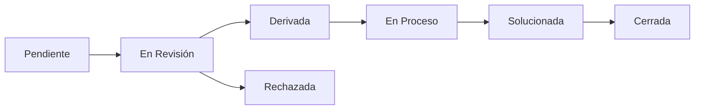

# 🏛️ AppIncidencias - Sistema de Gestión Municipal

<div align="center">


**Sistema integral para la gestión de incidencias y solicitudes de servicios municipales**

[🚀 Demo](#) · [📖 Documentación](#instalación) · [🐛 Reportar Bug](https://github.com/LuisCard3nas/AppIncidencias/issues)

</div>

---

## 📋 Descripción

**AppIncidencias** es una aplicación web desarrollada en Laravel que facilita la comunicación entre ciudadanos y autoridades municipales. Los ciudadanos pueden reportar problemas urbanos como baches, fallas en el alumbrado público, problemas de limpieza, entre otros, mientras que los funcionarios pueden gestionar, asignar y dar seguimiento a estas solicitudes de manera eficiente.

## ✨ Características Principales

### 🎭 Sistema de Roles
- **👥 Ciudadano**: Crear y consultar sus propias solicitudes
- **🏢 Funcionario**: Gestionar solicitudes asignadas
- **⚙️ Administrador**: Control total del sistema
- **🏛️ Alcalde**: Supervisión y gestión completa

### 📝 Tipos de Incidencias
- 🕳️ **Baches** - Reparación de vías
- 💡 **Alumbrado Público** - Mantenimiento de luminarias
- 🧹 **Limpieza** - Servicios de aseo urbano
- 💧 **Agua Potable** - Problemas de suministro
- 🚰 **Alcantarillado** - Mantenimiento de drenajes
- 🚌 **Transporte Público** - Mejoras en el servicio
- 🛡️ **Seguridad** - Temas de seguridad ciudadana
- 🔊 **Ruido** - Contaminación acústica
- 🌳 **Parques y Jardines** - Mantenimiento de áreas verdes
- 🚦 **Semáforos** - Mantenimiento vial
- 🚧 **Señalización** - Mejoras en señalética
- ❓ **Otros** - Solicitudes generales

### 📊 Estados de Seguimiento


## 🛠️ Tecnologías Utilizadas

- **Backend**: Laravel 11.x
- **Frontend**: Blade Templates + TailwindCSS
- **Base de Datos**: SQLite (desarrollo) / MySQL (producción)
- **Autenticación**: Laravel Breeze
- **Arquitectura**: Modular (Módulo de Incidencias)

## 📦 Instalación

### Prerrequisitos
- PHP 8.2 o superior
- Composer
- Node.js y npm
- SQLite/MySQL

### Pasos de Instalación

1. **Clonar el repositorio**
```bash
git clone https://github.com/LuisCard3nas/AppIncidencias.git
cd AppIncidencias
```

2. **Instalar dependencias**
```bash
composer install
npm install
```

3. **Configurar el entorno**
```bash
cp .env.example .env
php artisan key:generate
```

4. **Configurar la base de datos**
```bash
# Editar .env con los datos de tu base de datos
php artisan migrate
php artisan db:seed
```

5. **Compilar assets**
```bash
npm run build
```

6. **Iniciar el servidor**
```bash
php artisan serve
```

La aplicación estará disponible en `http://localhost:8000`

## 👤 Usuarios de Prueba

Después de ejecutar los seeders, tendrás acceso a estos usuarios:

| Rol | Email | Contraseña |
|-----|-------|------------|
| Alcalde | alcalde@test.com | password |
| Administrador | admin@test.com | password |
| Funcionario | funcionario@test.com | password |
| Ciudadano | ciudadano@test.com | password |

## 🚀 Uso

### Para Ciudadanos
1. Registrarse o iniciar sesión
2. Crear nueva solicitud especificando tipo, descripción y ubicación
3. Hacer seguimiento del estado de sus solicitudes

### Para Funcionarios/Administradores
1. Iniciar sesión con credenciales administrativas
2. Ver todas las solicitudes pendientes
3. Asignar responsables y cambiar estados
4. Gestionar el flujo de trabajo de las incidencias

## 🏗️ Arquitectura del Proyecto

```
app/
├── Models/              # Modelos principales
├── Modules/
│   └── Incidents/       # Módulo de Incidencias
│       ├── Models/      # Modelos específicos
│       ├── Controllers/ # Controladores del módulo
│       └── Resources/   # Vistas del módulo
└── Http/
    └── Controllers/     # Controladores generales
```

## 🤝 Contribuir

1. Haz fork del proyecto
2. Crea una rama para tu feature (`git checkout -b feature/AmazingFeature`)
3. Commit tus cambios (`git commit -m 'Add some AmazingFeature'`)
4. Push a la rama (`git push origin feature/AmazingFeature`)
5. Abre un Pull Request

## 📝 Licencia

Este proyecto está bajo la Licencia MIT. Ver el archivo [LICENSE](LICENSE) para más detalles.

## 👨‍💻 Autor

**Luis Cárdenas**
- GitHub: [@LuisCard3nas](https://github.com/LuisCard3nas)

---

<div align="center">
  <p>⭐ ¡No olvides dar una estrella si este proyecto te fue útil! ⭐</p>
</div>
